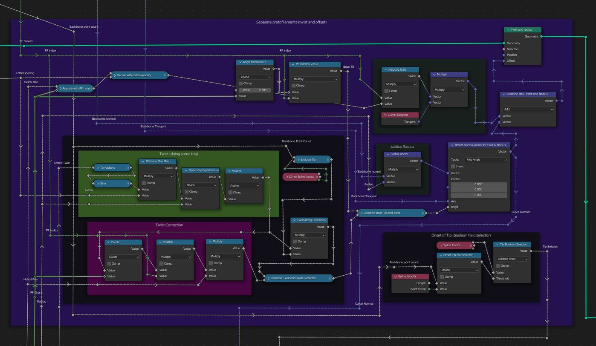
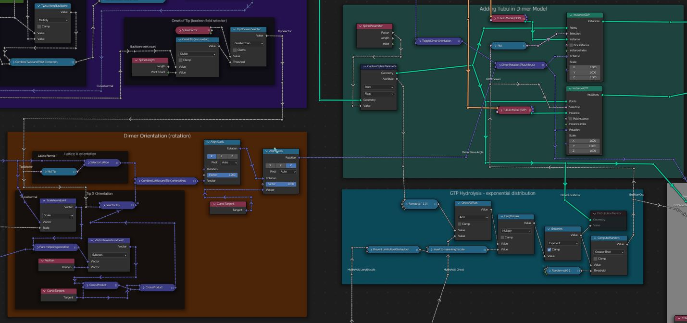
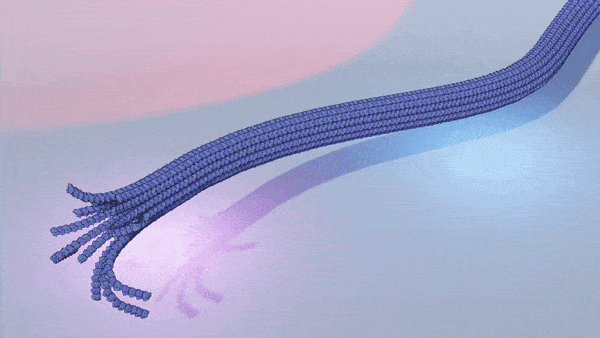

Blender has recently overhauled its fantastic `Geometry Nodes` system with the release of blender 3.0. As a microtubule enthusiast, I figured it was a perfect chance to make a procedural microtubule generator.

All you need to know is covered in the showcase video.

[Procedural Microtubule Blender 3.1 Geometry Nodes](https://youtu.be/AYUyAFqJXMk)

## Nodes setup at a glance

The easiest way to have a look at the nodes is to simply download the asset file or watch the showcase video. Alternatively, you can get the general gist of it from the images below.

We start by sampling the backbone in higher resolution, and capturing some attributes for later use.

We then add the 'flared' tip of the microtubule. Keep in mind that at this point the splines are all overlapping (no tube yet).

We then rotate and twist these splines around the backbone to make the hollow tube geometry

Finally we add the dimer model and the hydrolysis model. An area is left open for easy custom modification of the model ("maps & more").

## Demo videos

*Spline Manipulation*

*Procedural Microtubule lattice*

*Procedural Microtubule tip*

*GTP Hydrolysis*

## Download 

The geometry nodes setup and some tubulin models are available as an `asset` file. Blender 3.0 introduced the `asset` system and the `asset browser`, which makes using the node system as easy as drag and drop! You can watch a [quick introduction video](https://www.youtube.com/watch?v=ju-nFfL1euk) to get up to speed with that nice feature.

**Download and Use instructions**

1. Make sure you have **Blender 3.1** installed. This is (at the time of writing) still in beta.
2. Download the microtubule asset file (`.blend`). [from this onedrive link](https://1drv.ms/u/s!Agocf5W6i-Ewtkr4N52cFZC2M36l?e=Axhwwl) and save it to whatever (stable) location you like. Consider making a separate directory where you save all your blender assets for convenience. Best to save it in its own directory.
3. Open a new file in blender, and go to `edit` > `preferences` > `file paths ` > `asset libraries` and add the location you stored the asset file in to the list. You only need to do this once.
4. Drag in a new `area` (see [the official blender docs for info](https://docs.blender.org/manual/en/latest/interface/window_system/areas.html))
5. Change its type to `Asset Browser`
6. From the `Asset Browser`, select the asset file you downloaded (you will have given it a name in step **2**) 
7. Now just drag and drop into your scene! 
   *To get multiple microtubules, you should duplicate (`shift`+`d`) the first microtubule you added to the scene, **rather than dragging in it again from the asset library**. The latter will create completely 'independent' copies, which is probably not what you want.*

### Changelog

* **V1.2** More robust tip dimer orientation.

