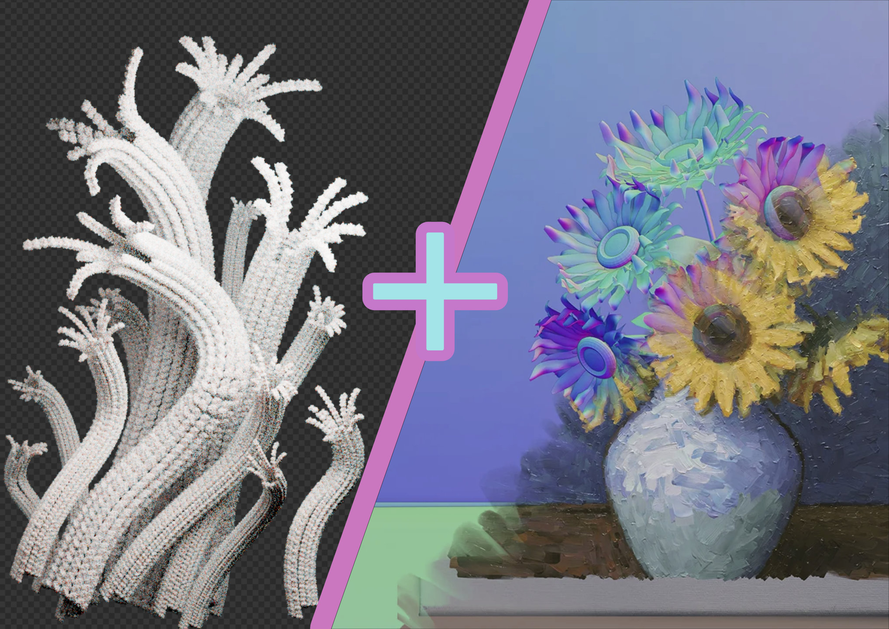
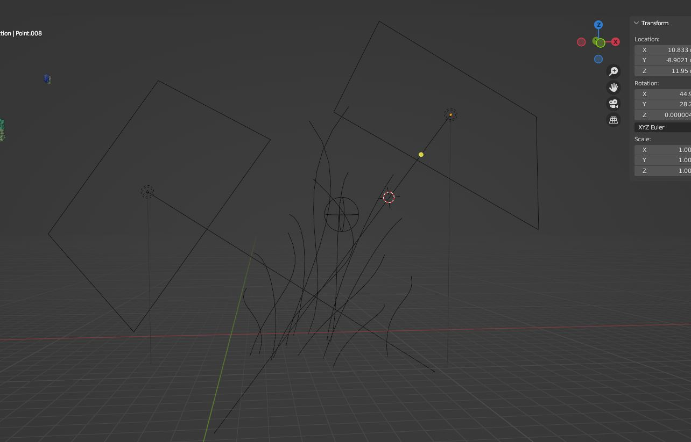
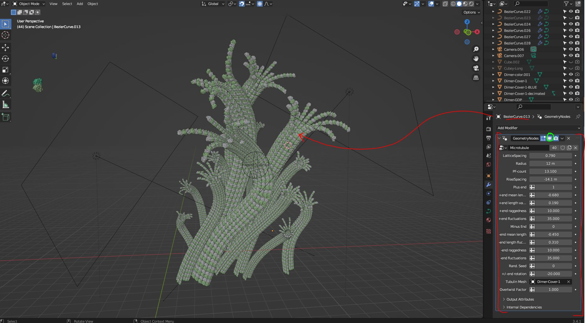
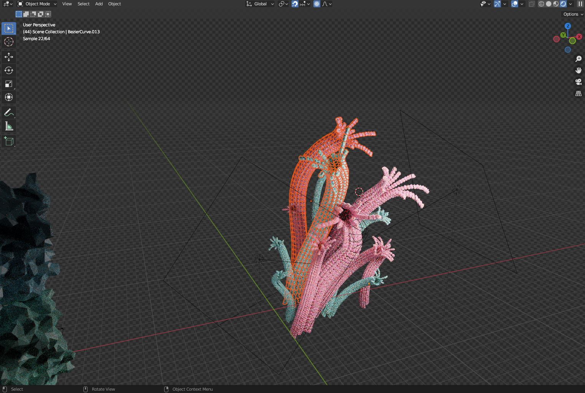
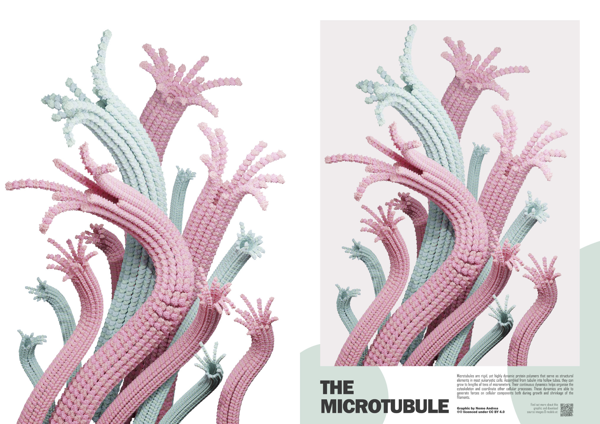
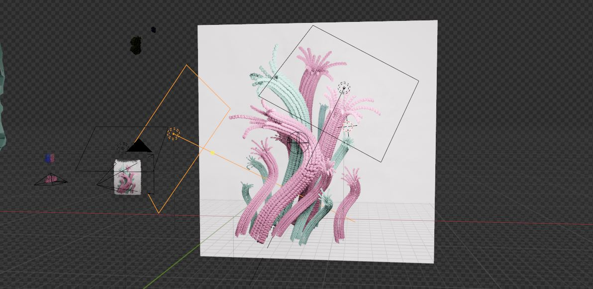
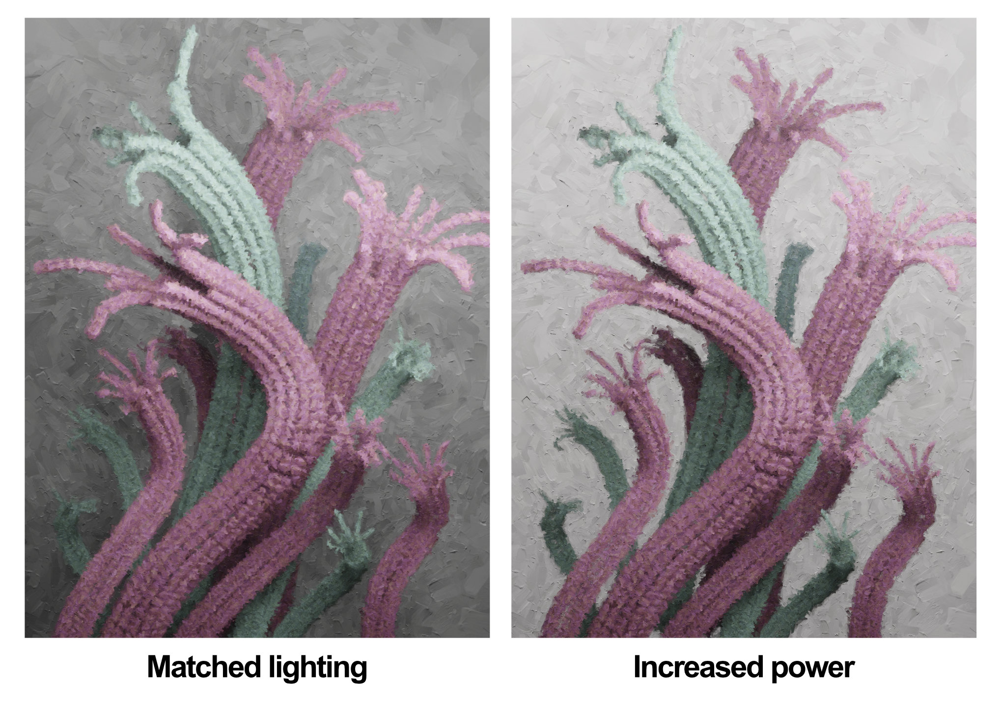
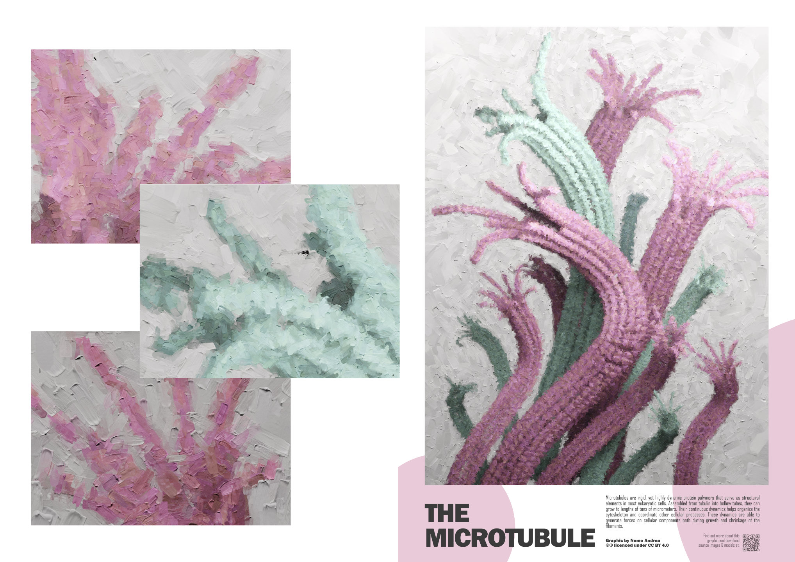

Recently I came across this very interesting blender geometry node set by Alan Wyatt called the [traditionalist toolbag](https://tradigital.gumroad.com/l/NjfQc?layout=profile). The full version is paid, but Alan provides [a nice user manual video](https://www.youtube.com/watch?v=KfaCCGJzj1g) and [an explainer video](https://www.youtube.com/watch?v=6uaJ0L4E390&t=3s) that you could use to implement a basic version yourself for free.

I decided to pick it up and **combine** it with my procedural microtubule (and other cytoskeletal filaments) generator. For more information about that asset set, you can [check out my blog post on it](2022-02-05-GeometryNodesTubule.md) — with a link t/o the asset files available for free 😉. 

### The 'realistic' render

As explained before, the scene is built up in Blender from procedurally generated microtubules. At it's core, the underlying editable geometry is just a bunch of basic splines.

If you enable the procedural geometry nodes microtubule in viewport, however, you will see that the microtubules nicely follow the geometry. In practice, you will probably edit the microtubule with that model *active* (rather than looking at the bare splines). The parameters of the microtubules can be set via the geometry nodes menu, to get the exact look and tip shape that you are looking for.

That is really the basics of the geometry. The splines, parameters, scene lights and materials (colours) are then tuned to aesthetic preference.

 A render of that scene then results in the graphic that is used on one of the two posters that were the final output. High quality downloads are available at the end of the document.

### The 'Painted' render

To make the 'painted' version, the scene was duplicated (full copy) and the rest of the *Traditionalist toolbag* was set up following the instructions. Since I wanted to have a background that somewhat matched the off-white of the 'realistic' version, I added a simple plane with a basic colour. I found a detail level of 5 to produce the results that worked for this application. Anything more and my poor GPU would have clocked out. 

I also found I needed to increase the power of the existing scene lights quite a bit to get the brightness to come close to the 'realistic' version. The values for the 'realistic' version were a bit moody; not a bad look but not fitting for the style of the poster.

Integrating this increased brightness variant into the same poster frame ends up working quite well together. The moodier variant looks quite out of place in the flat and bright poster frame.

### A note on biological accuracy

The procedural model for microtubules is based on the measured values for lattice spacing, rise and other parameters. The shape of the tip tries to resemble what is observed in cryo-electron microscopy and what has been simulated for these protein filaments, but is ultimately merely an 'artistic approximation'. Still, I think the tip shapes as depicted are not particularly unrealistic for the most part. What is unrealistic, however, is the strong curvature of the filaments. Microtubules are very stiff filaments (they are rather large by cellular standards after all), and would not bend on the length scale depicted. Their persistence length in absence of proteins that bind to microtubules in cells (which can decrease it significantly) is on the order of mm, and hence the lengths of filament depicted in the render (~200nm-1um) should be almost straight. The serpentine curvature was added for visual interest.

### Download

If you like these posters or renders and want to use them as a wallpaper or print it as a poster, feel free to do so! They are licenced under the creative commons `Attribution 4.0 International` ([CC BY 4.0](https://creativecommons.org/licenses/by/4.0/)); so have a look at that if you are concerned about usage rights. You can basically use them for whatever, as long as you provide appropriate credit. If you use the poster version you don't have to do anything as it already lists my name. If you use the renders without poster frame it would be sufficient to add something like `Nemo Andrea CC BY 4.0` somewhere in proximity. 

**Realistic render**

[Render only](https://drive.google.com/file/d/1LmekPBlKhMDRlljx2E1uqCHE9OEuZjbp/view?usp=share_link)

[Poster version](https://drive.google.com/file/d/1KyBcWFvr3UDBaYKhj-GkAef2K3kKQ0Aw/view?usp=share_link)

**Painted Render**

[Render only](https://drive.google.com/file/d/1LDVmv5BVJMTtgIssq7MD9c8iTyumHzSz/view?usp=share_link)

[Poster version](https://drive.google.com/file/d/1LEPuwKTpbx02MxOz1LnwHOXdiqJ2qi8M/view?usp=share_link)

