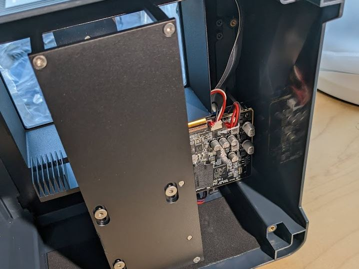
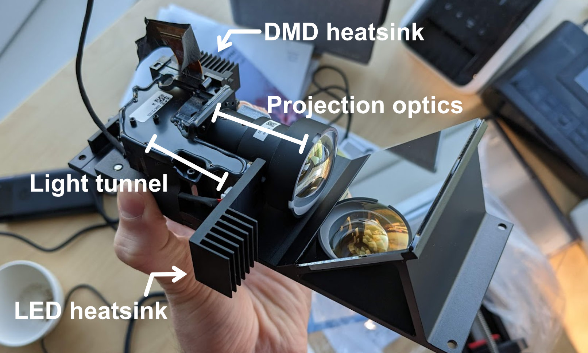
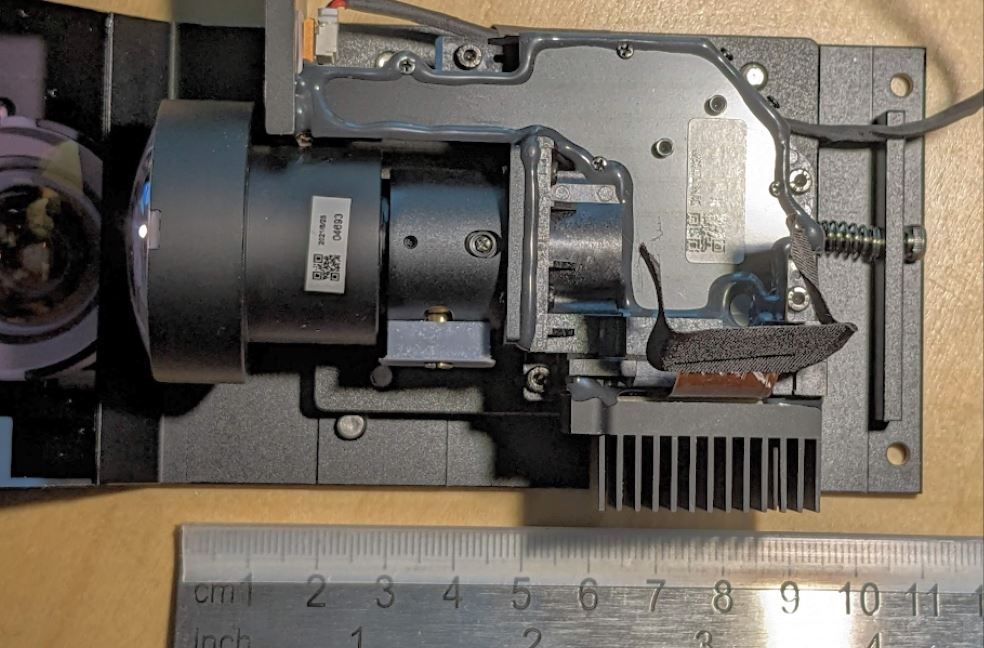
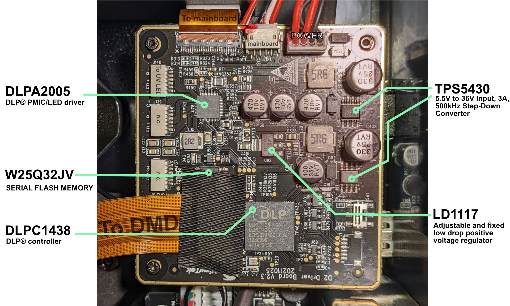
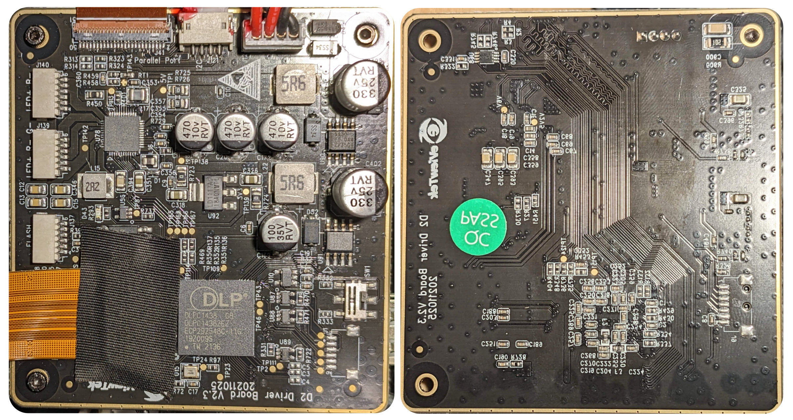
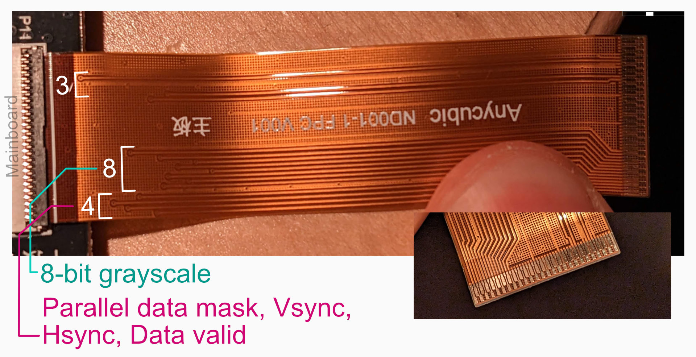
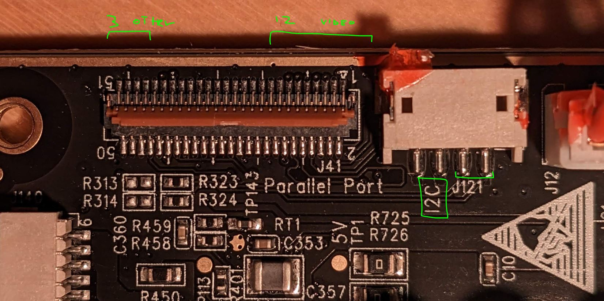

As part of my plan to make an open hardware Maskless Lithography Aligner I wanted to get more familiar with the Texas Instruments `DLP300S/301S` [(digital) micromirror device (DMD)](https://www.ti.com/product/DLP300S). This product [was created for use in 3D resin printers](https://e2e.ti.com/blogs_/b/enlightened/posts/3-key-design-decisions-for-any-dlp-3d-printer-design), which use patterned UV light to pattern photosensitive resin. I will update this blog post over time with more information, so it might be worth checking back occasionally ⏰.

The first and as of writing this post the only (to my knowledge) printers that uses this DMD are the Anycubic Photon [Ultra](https://www.anycubic.com/pages/anycubic-photon-ultra) and [D2](https://www.anycubic.com/collections/dlp-3d-printer/products/photon-d2-dlp-3d-printer). Given the price point that the DLP300S is available at, I expect more companies to follow. The main advantages of DMD over LCD are long lifetimes, possible improvement in edge definition and high energy efficiency. This makes DMD devices very common in traditional projectors - but there too LCDs still remain in use. In the professional maskless lithography business, both DMD and LCD(like)  systems are employed. The [Heidelberg μMLA](https://heidelberg-instruments.com/product/%CE%BCmla/) uses a DMD for its pattern formation, while its larger brother [the MLA150](https://heidelberg-instruments.com/product/mla150) uses some kind of LCD-like system. To get more familiar with the new TI DLP300s I had a look at the Photon Ultra.

*The Ultra is being phased out to make room for the newer D2, so I was able to get it for a pretty reasonable price. They should use the DMD and I expect minimal differences between them. For the D2, Anycubic has provided [some repair and replacement videos](https://www.youtube.com/watch?v=Aqb49YHgN8w), and even put a replacement DMD driver board for sale. This is an improvement over the Ultra and deserves mention.*

It seems like Anycubic does not produce the optical engine (marketing speak for optics and illumination) and driver board in-house, but contract it out to a company called [eViewTek](http://www.eviewtek.com/en/). If we open up the bottom of the unit, we can get our first glimpse at the projection unit and the driver board.

Unscrewing the optical engine by its four 2mm hex bolts we get a clearer picture at the projection unit itself. It connectors to the driver board by a flex PCB, and a separate 4-wire connector that seems to handle power for the 405nm UV LED. The flex cable has an intermediate connector that makes (dis)assembly easier.

The unit itself is pretty compact, measureing about 10cm along its longest axis. It can be translated along the optical axis with a basic screw in the back and the projection lenses seem to have some adjustment too, probably to change the focal point of the optic, which should of course coincide with the bottom of the resin vat in the 3D printer. The top panel covering the optics has a thick layer of opaque glue, which probably serves to prevent any UV light leak.

The driver PCB seems to closely mirror the recommendation laid out for the DLP300s in the excellent TI documentation. 

We spot the [TI DLPC1438](https://www.ti.com/product/DLPC1438), which is the only option when it comes to driving the DLP300/1s, so seeing that is no surprise. There is some flash memory present for the DLPC1438 in the form of a [winbond W25Q32JV](https://nl.mouser.com/datasheet/2/949/w25q32jv_revg_03272018_plus-1489806.pdf) variant. Then we spot some more boring components for power delivery such as the [TI TPS5430](https://www.ti.com/product/TPS5430) and the [STMicroelectronics LD1117](https://www.st.com/resource/en/datasheet/ld1117.pdf). Finally the remaining interesting IC on the board is the [TI DLPA2005](https://www.ti.com/product/DLPA2005), which is responsible for powering the illumination and micromirror and is in tight communication with the DLP controller. There are a few alternatives from TI that we could choose instead - the DLP301s datasheet lists the DLPA2000, DLPA3000 and DLPA3005 as alternative options.

*The DLPA2000 is just a lower current version of the DLPA2005. The DLPA3005 seems to be for very high current draws. *

In terms of outgoing connections, we see the ribbon cable that goes to the DMD, and the wires that go to the UV LED. This leaves two connectors unconnected; I suppose they keep these in for use in RGB projectors. Not sure what the `flash` connector is supposed to do. In terms of incoming connectors we see a power connector, a 3-wire connector (I2C and ground I strongly suspect - you can find out more about I2C communication with the `DLPC1438` [in the TI programming guide](https://www.ti.com/lit/ug/dlpu111/dlpu111.pdf?ts=1678723656711&ref_url=https%253A%252F%252Fwww.ti.com%252Fproduct%252FDLPC1438)) and finally another ribbon cable that all come from the mainboard. The rear of the board only has the usual collection of resistors and capacitors. In the image below I have flipped the image so that I can be overlaid over the image over the front of the board.

Let's have a closer look at this ribbon cable and connector. We see that a 51-pin (0.3mm pitch) FPC connector is used (seems a bit excessive in my opinion, but it probably allows cleaner routing on the boards) From what I can tell, only 15 tracks are used (excl. grounds). Looking at the Datasheet of the `DLPC1438` we see that our parallel interface needs 12 tracks. 8 for the grayscale value of a pixel, and then Vsync etc. We see nicely that 12 tracks seem to be grouped on the FPC.  We even see a nice grouping of 4 and 8 within this group; I am assuming that the cluster of 8 is the pixel grayscale value. 

That leaves us to figure out what the other 3 ones are for. The `DLPC1438` has a few special GPIO output signals when run in 'External Print Mode' that are intended to be used by the main controller. `GPIO_6` or 'System Ready signal' and `GPIO_9` or 'print active'. Other candidates for the signals might be the `HOST_IRQ` or the `PROJ_ON` signals. More detailed investigation of the traces will be needed to determine that.

The mainboard of the photon ultra can be viewed in more detail here in the [official retail image](../assets/photon-ultra/anycubic_ultra_mainboard.webp) from Anycubic. The CPU is a `GigaDevice GD32F307` (ARM Cortex-M4).

*Some other interesting things to note about this board is that the title of the board is 'D2 Driver board V2.3'. This seems to refer to the internal name for this optical engine by eViewTek. I wonder why they didn't call the first version of this 3D printer the D2. Secrets of the marketing department, I suppose.*

*While the chip in the Photon D2 is undoubtedly the same unit, there are some notable differences between the units, based on the repair video mentioned earlier. In the repair video we see an extra 4-wire cable connector to the optical engine. In addition, the driver board has been completely overhauled and instead of a flex cable for data exchange with the main board there are now just a few more regular copper wire connectors. I suspect this extra connector is needed for the [XPR unit](https://www.projectorjunkies.com/4k-dlp-projectors-is-it-real-4k-xpr-technology-explanation/) that 'increases' the 'resolution'  of the projected image by a factor of 4.*

