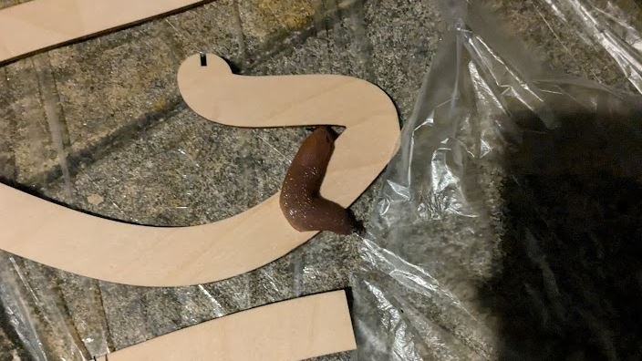
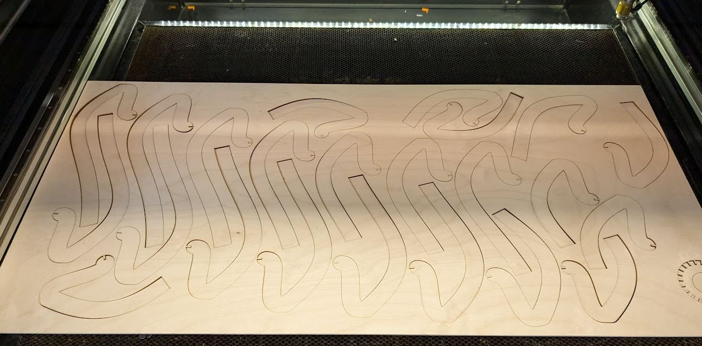

I recently designed a simple lamp that can be lasercut from multiplex (or other materials if you prefer) and is built around the IKEA RÅSEGEL lamp holder .(which takes standard E27 lamps). The source files and cuttable dxf files can be found on [the project's GtiHub page](https://github.com/NemoAndrea/lasercut-lamp).

The version I made for my own use is cut from simple birch multiplex and uses a standard Philips HUE RGBW bulb as a light source. I tried to finish the multiplex with a (spray) clearcoat, but I am not sure if that really did much due to absorption of the material. Giving it a light sanding would also help improve the surface finish, but from >20cm it is not really noticable that the multiplex is not entirely smooth.

It was a fun challenge to try to generate the designs in FreeCAD and then cutting them. Unfortunately I was not really easily able to get around generating  dxf files from each face without using the Draft workbench's projection tool. This projection tool projects all the edges of the part - hence also the backside of the part. This means each line in the dxf shapes is present twice! Not ideal, but I dont see a good way of doing that without hardcoding it or doing it manually. The way it is done now is at least still fairly friendly to custom revisions. If you have suggestions on how to export only a face to dxf, let me know!

 I was able to cut the design thanks to the CO2 lasercutters at the "Inventory" Makerspace on the TU Delft campus — big thanks to them and their funders!

