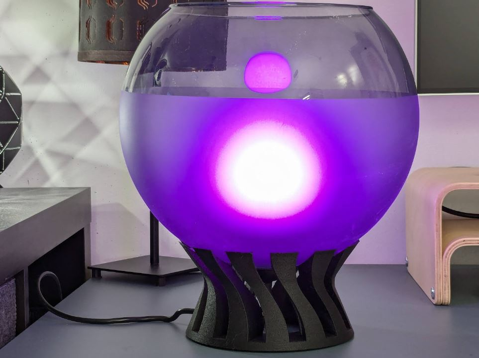
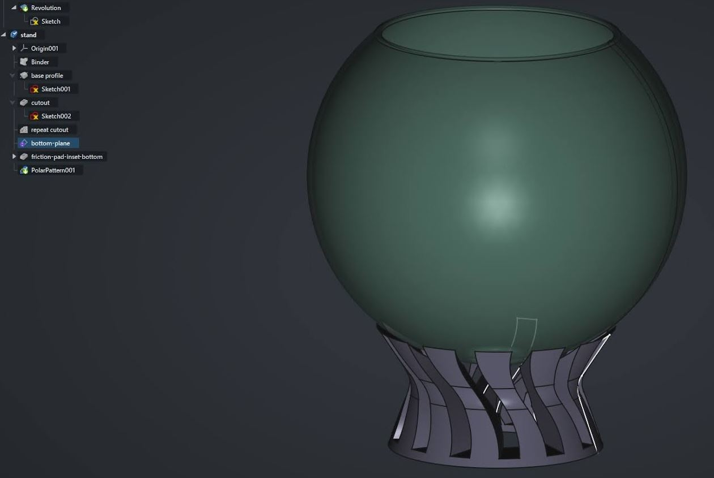

To [keep on the recent themes of lamp designs](https://nemoandrea.github.io/blog/lasercut-lamp-design-hue/), I recently designed a simple printable model that can be used to convert an IKEA Jacobsbyn lamp from a pendant lamp to a desk lamp. I find that it does not work very well as a pendant lamp due to direct line of sight to the bulb. 

The design files can be found on [GitHub](https://github.com/NemoAndrea/IKEA-Jacobsbyn-printable-lamp) or on [Printables](https://www.printables.com/model/999550-ikea-jacobsbyn-table-lamp-stand). There you will find more practical instructions. 

