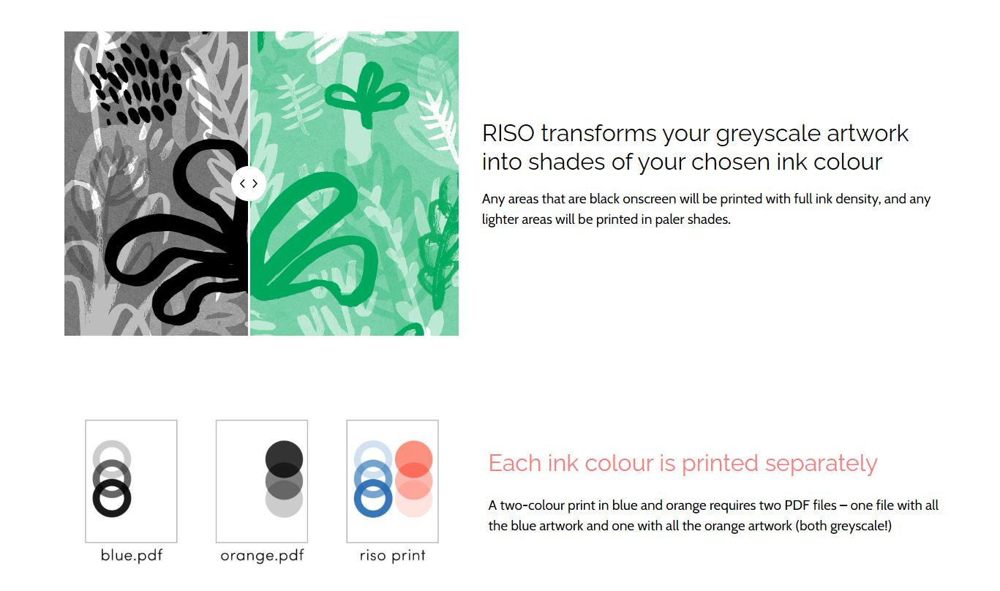
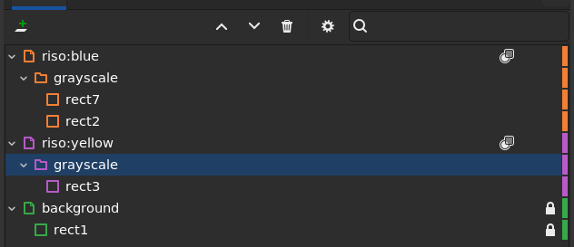
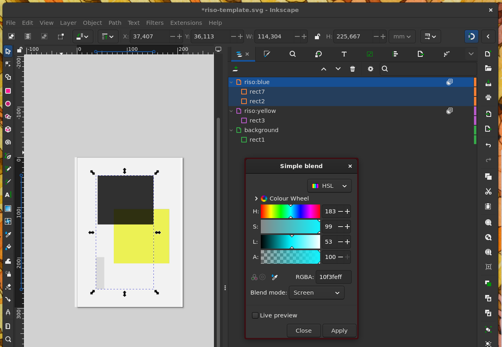
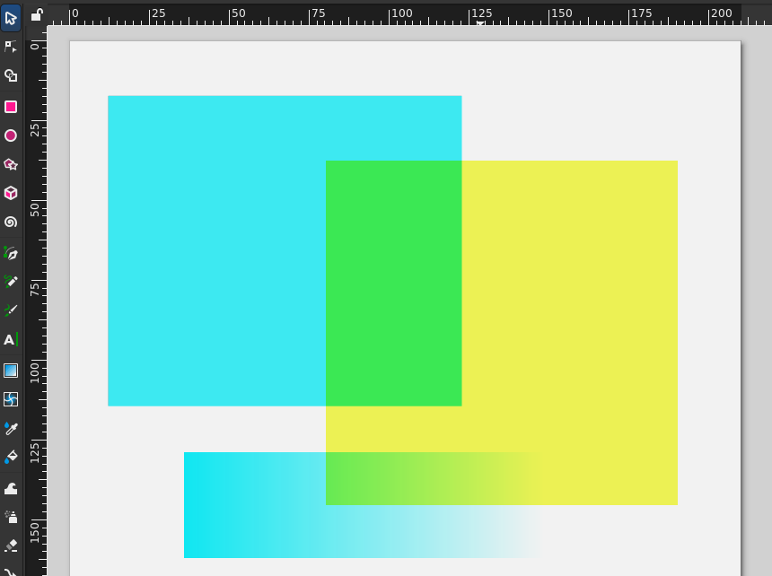
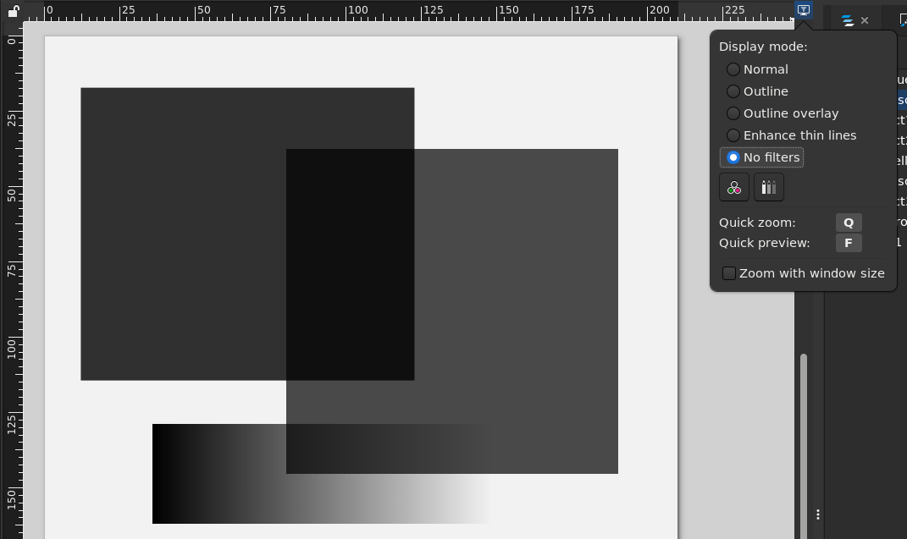
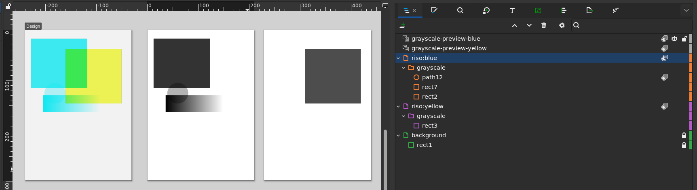
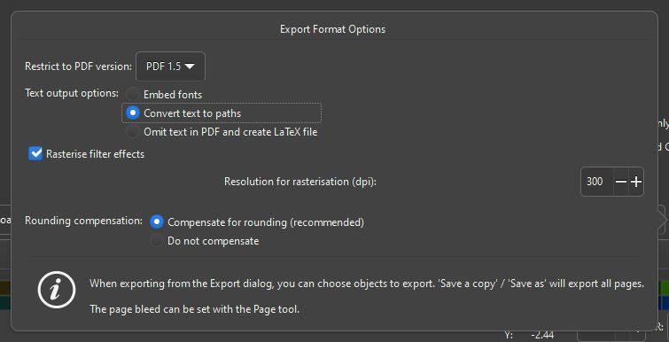

## Background

I've recently gotten rather interested in a printing process referred to as [Risographs](https://www.commarts.com/columns/the-rise-of-riso). A risograph machine uses a (machine generated) stencil that is wrapped around an ink drum. With this, patterns of a single hue can be quickly and economically applied to paper. Multiple colours require multiple passes through the machine, and consequently introduce registration errors. The main reason to use these for art is either (1) economics for high volume printing or (2) ability to use unique inks (fluorescent, metallic). For designs with more than 3 distinct hues (excluding colours that can be made by blending) or ones that do not require special ink types, it may be better (and cheaper sometimes) to stick to an inkjet process or similar.

> It should be mentioned that Risograph is just a brand name of the Riso Kagaku Corporation, but nowadays it has become a bit of a catch-all for art that is created with a 'stencil duplicator' - irrespective of whether it was actually made using a Risograph machine. 

## What elements of Risograph printing do we need to capture?

Let's start by understanding the basics of the Risograph machine. A stencil can allow varying amounts of ink through each location. With this, various luminosities of a single hue can be produced. The illustration below from the [outoftheblueprint.org](https://outoftheblueprint.org/files/) captures this nicely:



Note that the file that we provide to the printer is a grayscale image.

Another element we need to consider is that colours can blend together[^1]. There isn't anything particularly magical about this, but it means with 2 colours you can get another hue by blending the two together and we would like to be able to see this also in Inkscape.

If you want to read a little bit more about the peculiarities of the medium and options such as halftoning method, I would recommend [this short document from University of Illinois](https://web.faa.illinois.edu/app/uploads/sites/6/2021/05/riso_print_guide.pdf). 

## Setting up Inkscape for Risographs

The general structure splits each colour onto a separate layer, and all items within a layer are **pure grayscale** objects. The latter is important, because it makes exporting the file for the Riso machine trivial. It also means you do not need to worry about switching between colours, as all items in the graphic are pure grayscale. The colour is set only once per layer, and is applied as an Inkscape filter.

```txt
[Layer N] -- filter(apply-my-colour(colorN))  --blend-mode=multiply
    <g>...</g>    
...
[Layer 2] -- filter(apply-my-colour(color2))  --blend-mode=multiply
    <g><text>Cool Text</text></g>
    ...
[Layer 1] -- filter(apply-my-colour(color1))  --blend-mode=multiply
    <g><rect></rect></g>
    ...
[Background]  
    <rect fill="background-color"></rect>
```

If we do that for a simple two-colour case, we get the following:



The presence of the `grayscale` folder is not strictly required, but it will become useful later.

The nature of the filter is a 'Simple Blend' (available under `Filter > Color > Simple Blend`) with the blend mode set to `screen` as in the screenshot below 



We do this procedure for each color layer:
1. Create a layer for the colour
2. Set layer blend mode to `multiply`
3. Create a group within that layer called `grayscale` (name doesn't matter)
4. Apply a `Simple Blend` filter to the layer, with blend mode set to `screen`, with a colour that looks close to the riso ink you will use.
5. Add your content to the `grayscale` group, where only grayscale fill and stroke are used.
6. If content within a color overlaps, set each content item's blend mode to `multiply` too.

If you have done the above, you will get this kind of behaviour for our example blue and yellow example case:   



As a check, we can activate the 'no filter' display mode in Inkscape. We should then only see grayscale content:



> [!warning] Warning: make sure that all content is truly grayscale!
> There is nothing preventing you from selecting non-grayscale fills and strokes for content in each colour layer. Non-grayscae colours
> will still be mapped to something close to the target colour, but there is no predicting how that would end up being interpreted later on. Keep an eye on it, or at least check during export.

You can check your setup against [the example file that I have been using in this post](../assets/20250303-riso/riso-template.svg)

## Exporting and tips

In the end, you will have to export each layer to a separate grayscale file. Good thing we already split each colour in its own layer. We can actually do even better, and keep a separate, live clone of each colour in grayscale in the same document to preview and export.

To do this, simply duplicate the page for each colour, and create a clone of the `grayscale` group and position it in the same place on the separate pages! For the clone, make sure to remove any filter effects. The clone is dynamic, so as you work in the colour preview, this grayscale preview will update with it. Once you are ready to export the grayscale files, simply export those pages!



> [!tip] Tip: to align the grayscale clone on the duplicate page, you can (if the design fits within the page) just copy the coordinates of the group in the color design. If it does not fit within the page, a temporary dummy item in the corner of the page will aid alignment.

> [!tip] Tip: you can also scale clones, allowing you to create different print sizes for your design (e.g. A4 or A3 Riso)

> [!warning] Warning: Inkscape's selection is nontrivial. In case of issues, make sure you are truly working within a group and that you have the right item selected (also when applying filters).

## Other points

* ⚙ It is important that all the filter effects you may use are flattened in the final output. Whenever you export as a PDF Inkscape will ask you for a rasterization DPI. Make sure to pick a DPI that equals or exceeds 300dpi. Particular changes may need to be made based on the machine that you are using.


[^1]: metallic inks may blend in different ways, blocking out the colours below. 


